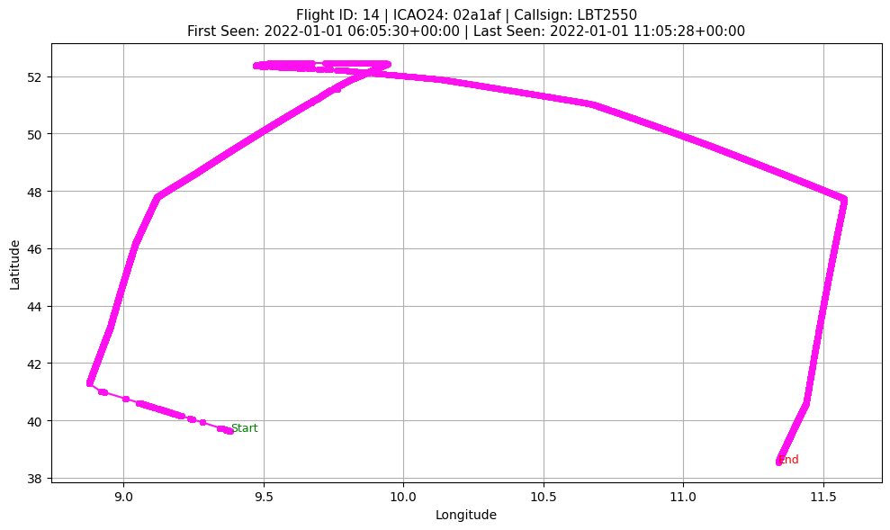
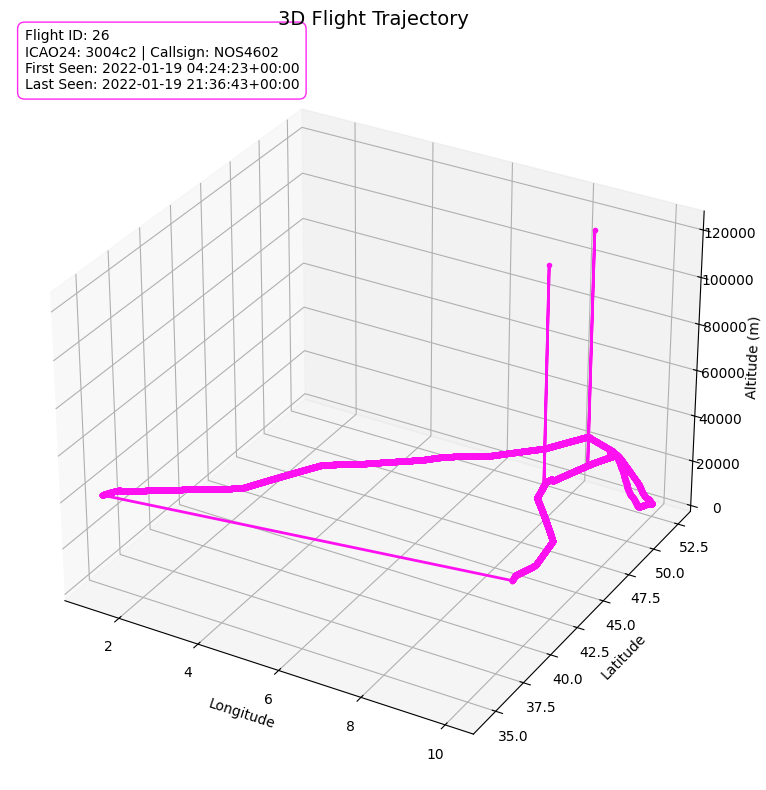
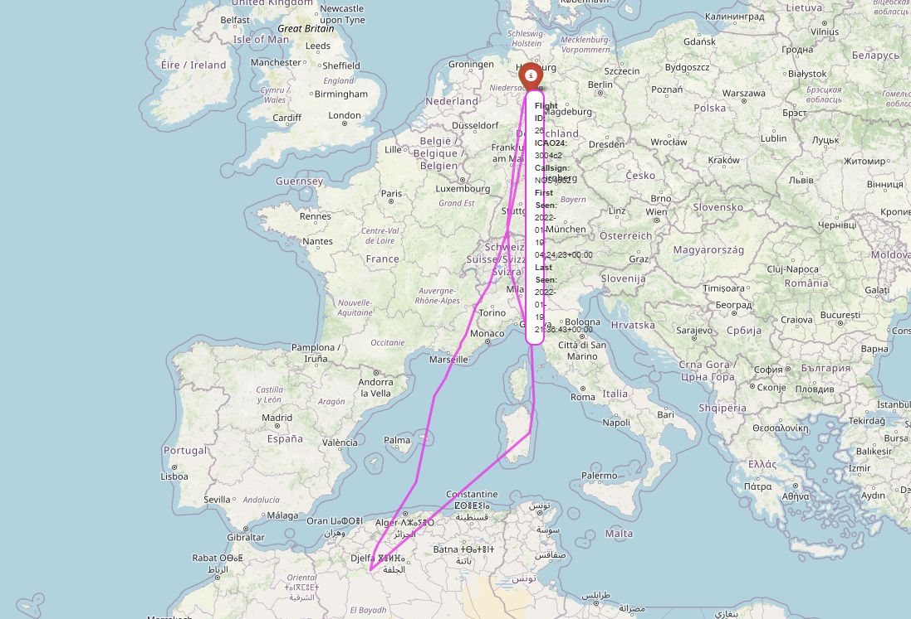

# Aircraft_Noise

Task1: Trajectory Calculation 

Objective / Purpose: Processes and visualizes aircraft trajectory data, for the purpose of analyzing air traffic or noise patterns
Key steps performed:

1. Setup and Environment: traffic, pandas, joblib, openpyxl, matplotlib, folium, and ipywidgets.
2. Data Loading: 
•	Loaded aircraft trajectory data from a  joblib file (For example: data_2022_january.joblib).
•	Converted the data into a Pandas Data Frame (df_adsb).
•	Displayed a preview and metadata of the dataset.
3. Preprocessing:
•	Extracted the date from the timestamp to facilitate grouping by flight.
•	Sorted the data to preserve the order of aircraft movement over time
4. Flight Identification 
•	Grouped data by aircraft ID (icao24) and date to identify unique flights.
•	Assigned a unique flight ID to each flight.
•	Aggregated metadata (first and last timestamp) for each flight.
5.   Visualization Setup:
•	Created interactive widgets using Ipy widgets to allow users to select an aircraft (icao24) and a date.
•	Prepared for interactive visualizations, likely using folium for map-based plots and matplotlib for other types.

